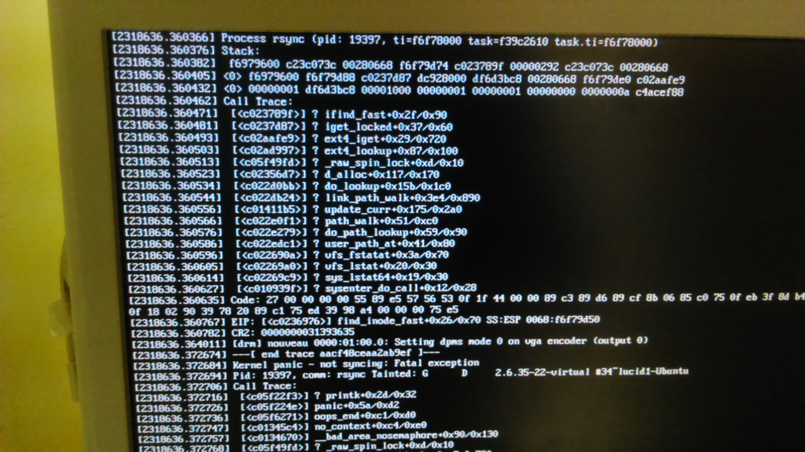

In a Ubuntu server, while cloning to a CompatFlash rsync failed with call trace.
The following pictures show us the issue found

Checking the log's also show us huge logs on _/var/log_ directory

    ~# du -sh /var/log/* | grep G | sort

            1.4G    /var/log/syslog.1
            3.7G    /var/log/debug
            11G     /var/log/debug.1

A lot of logs from slapd

    ~# tail -f /var/log/syslog

        Mar  2 13:10:31 my-server slapd[4397]: conn=1939 op=1 BIND dn="" method=128
        Mar  2 13:10:31 my-server slapd[4397]: conn=1939 op=1 RESULT tag=97 err=0 text=
        Mar  2 13:10:31 my-server slapd[4397]: conn=1937 op=1 BIND dn="" method=128
        Mar  2 13:10:31 my-server slapd[4397]: conn=1937 op=1 RESULT tag=97 err=0 text=
        Mar  2 13:10:31 my-server slapd[4397]: conn=1938 op=1 BIND dn="" method=128
        Mar  2 13:10:31 my-server slapd[4397]: conn=1938 op=1 RESULT tag=97 err=0 text=
        Mar  2 13:10:31 my-server slapd[4397]: conn=1934 op=1 BIND dn="" method=128
        Mar  2 13:10:31 my-server slapd[4397]: conn=1934 op=1 RESULT tag=97 err=0 text=
        Mar  2 13:10:31 my-server slapd[4397]: conn=1937 op=2 SRCH base="ou=people,ou=company,dc=com" 
        scope=1 deref=0 filter="(&(objectClass=posixAccount)(uid=root))"
        Mar  2 13:10:31 my-server slapd[4397]: conn=1937 op=2 SEARCH RESULT tag=101 err=0 nentries=0 text=
        Mar  2 13:10:31 my-server slapd[4397]: conn=1939 op=2 SRCH base="ou=people,ou=company,dc=com" scope=1 deref=0 filter="(&(objectClass=posixAccount)(uid=root))"
        Mar  2 13:10:31 my-server slapd[4397]: conn=1939 op=2 SEARCH RESULT tag=101 err=0 nentries=0 text=
        Mar  2 13:10:31 my-server slapd[4397]: conn=1934 op=2 SRCH base="ou=people,ou=company,dc=com" scope=1 deref=0 filter="(&(objectClass=posixAccount)(uid=root))"

Let's check debug level of OpenLDAP Server on _slapd.conf_ file

    ~# egrep -v "#" /etc/ldap/slapd.conf | grep loglevel

            loglevel      2

Change loglevel to 256 as described in [openldap] website
The  256 value stats log connections/operations/results.

    ~# sed -i "s/loglevel .*/loglevel      256/g"    /etc/ldap/slapd.conf
    
            loglevel      256

Restart slapd

    ~# service slapd restart
        Stopping OpenLDAP: slapd.
        Starting OpenLDAP: slapd.

Delete old log files

    ~# rm /var/log/{debug.1,syslog.1}

Check files again

    ~# du -sh /var/log/* | grep G | sort

        3.7G    /var/log/debug

Let's check the kernel ring buffer:

    ~# dmesg -T -l err | grep sd

        [Wed Mar  2 11:57:43 2016] Buffer I/O error on dev sde, logical block 0, async page read
        [Wed Mar  2 11:57:48 2016] sd 6:0:0:1: [sde] UNKNOWN(0x2003) Result: hostbyte=0x00 driverbyte=0x08
        [Wed Mar  2 11:57:48 2016] sd 6:0:0:1: [sde] Sense Key : 0x2 [current] 
        [Wed Mar  2 11:57:48 2016] sd 6:0:0:1: [sde] <<vendor>>ASC=0xff <<vendor>>ASCQ=0xff 
        [Wed Mar  2 11:57:48 2016] sd 6:0:0:1: [sde] CDB: opcode=0x28 28 00 00 00 00 00 00 00 08 00
        [Wed Mar  2 11:57:48 2016] blk_update_request: I/O error, dev sde, sector 0
        [Wed Mar  2 11:57:48 2016] Buffer I/O error on dev sde, logical block 0, async page read 

Ok, so rsync fail not for the lack of space on CompatFlash but due to a  I/O error on dev sde.
After replacing CF this issue is solved and I can clone filesystem to the new CF :-)

    ~# mount /dev/disk/by-id/ata-ELITE_PRO_CF_CARD_16GB_20081205_0001843C-part1      /media/compat-flash
    ~# mount | grep sde

        /dev/sde1 on /media/compat-flash type ext2 (rw,noatime,nodiratime,errors=remount-ro)

-----
[openldap]: <http://www.openldap.org/doc/admin24/slapdconfig.html>
